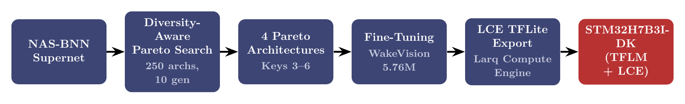
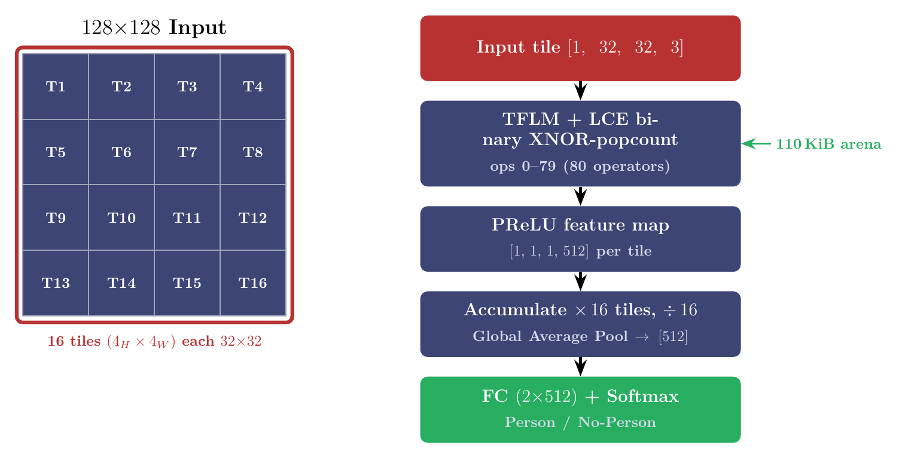
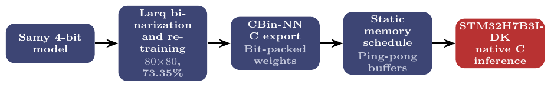

# BNN-WakeVision-STM32

Binary Neural Network deployment on STM32H7B3I-DK for [WakeVision](https://github.com/harvard-edge/Wake_Vision) person detection.

Accompanying paper: **"Binarized Wake-Up of Conversational Agents on an Industry-Grade High-Performance Microcontroller"**, IEEE COINS 2026 — see [`paper/main.pdf`](paper/main.pdf).

Two complete binary deployment pipelines on a single Cortex-M7 target (280 MHz, 1.4 MB SRAM, 2 MB Flash):

1. **NAS-BNN + Larq Compute Engine + TFLM** — neural-architecture search over a binary supernet, exported via LCE, running on TensorFlow Lite Micro with XNOR-popcount kernels.
2. **Samy 4-bit → Larq binarization → CBin-NN C export** — model-centric binarization of the WakeVision Samy reference, converted to standalone bit-packed C with static memory scheduling.

---

## Deployment results on STM32H7B3I-DK

| Model | Input | Latency | Power | Energy | RAM | Flash | Accuracy |
|-------|-------|--------:|------:|-------:|----:|------:|---------:|
| MCUNet-320kB (int8, ref) | 144×144 | 410 ms | 90 mW | 36.9 mJ | 393 KiB | 924 KiB | 85.9% |
| **NAS-BNN Key 4 (ours, LCE)** | 32×32 | **50.29 ms** | **60 mW** | **3.02 mJ** | **110 KiB** | 418 KiB | 80.41% |
| Samy 4-bit (ref) | 80×80 | 37.4 ms | 100 mW | 3.7 mJ | 26.98 KiB | 56.62 KiB | 79.9% |
| **Binary Samy (CBin-NN, ours)** | 80×80 | **30.5 ms** | 80 mW | **2.4 mJ** | **9.38 KiB** | **7.03 KiB** | 73.35% |

Power measured as active − idle (digital multimeter in series with board supply). Energy = power × mean latency.

---

## Pipeline 1 — NAS-BNN → TFLM + LCE



Binary supernet search (NAS-BNN) → diversity-aware Pareto selection → fine-tuning on 5.76 M WakeVision images → LCE TFLite export → STM32 firmware.

**Memory challenge:** at full 128×128, float32 skip-connection tensors (e.g. tensor T#79: [1,64,64,48] = 768 KiB) exceed the 480 KiB SRAM budget. Solution: 16-tile 2D spatial input-streaming.



Input partitioned into 16 × 32×32 tiles on a 4×4 grid. Each tile runs through the same TFLM+LCE binary trunk (110 KiB arena), producing a [1,1,512] PReLU feature map. Tile features are accumulated → global average pool → single FC + Softmax.

---

## Pipeline 2 — Samy → CBin-NN



Samy 4-bit model (WakeVision Challenge reference) → Larq retraining with {−1,+1} constraints → CBin-NN C code generation → native STM32 inference.

CBin-NN collapses flash 56.62 KiB → **7.03 KiB** (cross-channel bit-packing) and RAM 26.98 KiB → **9.38 KiB** (ping-pong activation buffers, static schedule).

---

## Repository layout

```
.
├── LICENSE
├── README.md
├── figures/               # PNG figures for documentation
├── paper/                 # Camera-ready paper (IEEE COINS 2026, PDF)
├── nasbnn/                # NAS-BNN supernet, search, fine-tuning, LCE export
├── checkpoints/           # Fine-tuned PyTorch checkpoints — see Releases ↓
├── search_results/        # Diversity-aware Pareto search artifacts
├── tflite_models/         # LCE TFLite + int8 reference TFLite (Keys 3–6)
├── stm32_firmware/        # STM32CubeIDE project: TFLM + LCE binary inference
└── samy_cbinnn/           # Samy binarization notebook + Larq weights
```

---

## Checkpoints

Fine-tuned NAS-BNN checkpoints (~1.9 GB total) are hosted in [GitHub Releases](../../releases).

| Key | OPs (M) | Fine-tuned Acc. | File |
|-----|--------:|----------------:|------|
| 3 | 3.85 | 80.31% | `nasbnn_key3_best_ep29_acc80.31_f10.7895.pth.tar` |
| 4 | 4.40 | **80.41%** | `nasbnn_key4_best_ep29_acc80.41_f10.7934.pth.tar` |
| 5 | 5.24 | 80.61% | `nasbnn_key5_best_ep23_acc80.61_f10.7930.pth.tar` |
| 6 | 6.03 | 80.88% | `nasbnn_key6_best_ep27_acc80.88_f10.7937.pth.tar` |

Download and place in `checkpoints/` before running evaluation scripts.

---

## Quick start

### NAS-BNN path

```bash
cd nasbnn
pip install -r requirements.txt

# Run search
python search.py --config examples/wakevision_config.py

# Fine-tune selected key
python train.py --key 4

# Export LCE TFLite
python build_lce_tflite.py --key 4

# Evaluate
python eval_finetuned.py --key 4
```

### Samy + CBin-NN path

Open `samy_cbinnn/Samy_binary.ipynb`. Requires `larq>=0.13`, `tensorflow>=2.10`. Then use [CBin-NN](https://doi.org/10.3390/electronics13091624) to export `samy_cbinnn/samy_bnn.h5` to C.

### STM32 firmware (TFLM + LCE)

Open `stm32_firmware/` in STM32CubeIDE 1.13+. Model embedded as `Core/Inc/model_data.h`. Flash, read UART @ 115200 — DWT latency counter outputs mean/min/max over 10 inferences.

---

## Pareto front (NAS search, WakeVision subset)

| Key | OPs (M) | Search Acc. (%) |
|-----|--------:|----------------:|
| 3 | 3.85 | 87.39 |
| 4 | 4.40 | 87.74 |
| 5 | 5.24 | 87.77 |
| 6 | 6.03 | 87.81 |

Diversity-aware parent selection: 70% Pareto front / 20% non-Pareto re-exploration / 10% random. 250 architectures evaluated (population 50, 10 generations) from an estimated 3.3×10¹⁷ possible configurations.

---

## Citation

If this work is useful, please cite:

```bibtex
@inproceedings{mohammady2026binarized,
  author    = {Mohammady, Sepehr and Ballout, Hadi and Bellotti, Francesco and Lazzaroni, Luca and Berta, Riccardo and Fresta, Matteo and Saad, Ammar and Pighetti, Alessandro},
  title     = {Binarized Wake-Up of Conversational Agents on an Industry-Grade High-Performance Microcontroller},
  booktitle = {Proc. IEEE Int. Conf. Omni-layer Intelligent Systems (COINS)},
  year      = {2026}
}

@article{lin2025nasbnn,
  author  = {Lin, Zhihao and Wang, Yongtao and Zhang, Jinhe and Chu, Xiaojie and Ling, Haibin},
  title   = {{NAS-BNN}: Neural Architecture Search for Binary Neural Networks},
  journal = {Pattern Recognit.},
  volume  = {159},
  pages   = {111086},
  year    = {2025}
}

@article{sakr2024cbinnn,
  author  = {Sakr, Fares and Berta, Riccardo and Doyle, Joseph and Capello, Andrea and Dabbous, Ahmad and Lazzaroni, Luca and Bellotti, Francesco},
  title   = {{CBin-NN}: An Inference Engine for Binarized Neural Networks},
  journal = {Electronics},
  volume  = {13},
  pages   = {1624},
  year    = {2024}
}

@article{banbury2025wakevision,
  author  = {Banbury, Colby and others},
  title   = {Wake Vision: A Tailored Dataset and Benchmark Suite for {TinyML} Computer Vision Applications},
  journal = {arXiv preprint arXiv:2405.00892},
  year    = {2025}
}
```

## License

MIT — see [LICENSE](LICENSE). Third-party components retain their own licenses: NAS-BNN (VDIGPKU), Larq Compute Engine (Plumerai/Apache 2.0), CBin-NN (ELIOS lab), TensorFlow Lite Micro (Apache 2.0).
