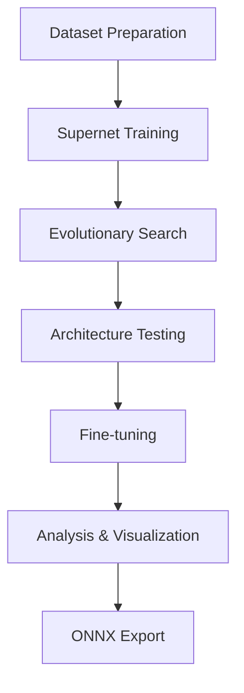

# NAS-BNN Multi-Dataset Pipeline 🚀

[](https://python.org)
[](https://pytorch.org)
[](https://developer.nvidia.com/cuda-toolkit)

## 🔍 **Projects at a Glance**

| Repository | Purpose | Key Features |
|------------|---------|--------------|
| [VDIGPKU/NAS-BNN](https://github.com/VDIGPKU/NAS-BNN) | Original Implementation | NAS-BNN framework for ImageNet, Linux/multi-GPU focus |
| [NAS-BNN-CIFAR10-Exploration](https://github.com/SepehrMohammady/NAS-BNN-CIFAR10-Exploration) | CIFAR-10 Adaptation | Windows compatibility, CIFAR-10 support, resume logic |
| [Efficient-NAS-BNN-Pipeline](https://github.com/SepehrMohammady/Efficient-NAS-BNN-Pipeline) (this repo) | Multi-Dataset Pipeline | WakeVision support, unified workflow, enhanced analysis tools |

**This repository consolidates the previous work and is the recommended version for all use cases.**

## 🎯 **Major Updates - WakeVision Integration with 500k Sample Dataset**

### ✅ **Successfully Adapted NAS-BNN for Person Detection**
- **🏆 Achieved 88.81% accuracy** on WakeVision person detection after fine-tuning
- **📈 1.13% improvement** from initial architecture search results
- **⚡ Optimized architectures** with 3.8M-6.2M operations for edge deployment
- **📊 Complete Pareto front analysis** with 4 optimal architectures discovered

### 🔧 **Enhanced Pipeline Features**
- **🖥️ Windows compatibility** with proper DataLoader handling (`workers=0`)
- **🔄 Resume capability** for long-running training sessions
- **📝 Enhanced logging** with improved accuracy parsing from multiple log formats
- **📊 Comprehensive analysis** with automated visualization tools
- **🎯 Multi-dataset support** - ImageNet, CIFAR-10, and WakeVision

---

## 📈 **WakeVision Results Summary**

### **Architecture Search Results:**
| OPs Key | Operations (M) | Search Accuracy | Test Accuracy | Fine-tuned Accuracy | Improvement |
|---------|----------------|-----------------|---------------|-------------------|-------------|
| **5** ⭐ | 5.236M | 87.77% | 87.68% | **88.81%** | **+1.04%** |
| **6** | 6.026M | 87.81% | 87.7-87.8% | **88.81%** | **+1.00%** |

### **Key Findings:**
- **Both Key 5 and Key 6 achieve excellent results**: 88.81% accuracy after fine-tuning
- **Key 5 offers better efficiency**: Slightly fewer operations with same accuracy
- **Successful fine-tuning**: Significant accuracy improvements achieved
- **Edge-ready deployment**: Models optimized for resource-constrained devices
- **Larger dataset provides better results**: Training with 500,000 samples yielded higher accuracy

---

## 🔍 **Project Origins & Acknowledgment**

### **Original Work**
This project is based on the official implementation of **["NAS-BNN: Neural Architecture Search for Binary Neural Networks"](https://arxiv.org/abs/2408.15484)** by [VDIGPKU/NAS-BNN](https://github.com/VDIGPKU/NAS-BNN).

### **Development History**
- **Initial Adaptation**: First adapted for CIFAR-10 in the [NAS-BNN-CIFAR10-Exploration](https://github.com/SepehrMohammady/NAS-BNN-CIFAR10-Exploration) repository, which focused on extending the original work to smaller datasets with enhanced Windows compatibility.
- **Current Repository**: This repository consolidates and extends both works with multi-dataset support, focusing on WakeVision for person detection, while maintaining support for ImageNet and CIFAR-10.

The original README from the authors is preserved in `README-Authors.md`.

---

## 🚀 **Quick Start for WakeVision**

### **1. Setup Environment**
```bash
# Clone and install dependencies
git clone https://github.com/SepehrMohammady/Efficient-NAS-BNN-Pipeline.git
cd Efficient-NAS-BNN-Pipeline
pip install -r requirements.txt
```

### **2. Configure for WakeVision**
```python
# In run_all.ipynb Cell 2 - Configuration
dataset_name = "WakeVision"
architecture_name = "superbnn_wakevision_large"
wakevision_img_size = 128  # Image size (64 or 128) - must match across all components

# ⚠️ IMPORTANT: Image size consistency required!
# - superbnn.py: superbnn_wakevision_large(img_size=128)  
# - prepare_local_wake_vision_from_csv.py: TARGET_IMAGE_SIZE = (128, 128)
# - run_all.ipynb: wakevision_img_size = 128
```

### **3. Prepare Data**
Choose your data preparation method:
- **Local CSV**: Use existing local WakeVision data and CSV files  
- **Online**: Automatic download from HuggingFace datasets

**⚠️ Important:** Ensure image size consistency across all components before starting!

### **4. Image Size Consistency Checklist** ✅
Before running the pipeline, verify these three files have matching image sizes:

```bash
# 1. Check model architecture (should be 128 for best results)
grep "def superbnn_wakevision_large" models/superbnn.py
# Expected: def superbnn_wakevision_large(sub_path=None, img_size=128):

# 2. Check data preparation script
grep "TARGET_IMAGE_SIZE" prepare_local_wake_vision_from_csv.py  
# Expected: TARGET_IMAGE_SIZE = (128, 128)

# 3. Check notebook configuration (Cell 2)
grep "wakevision_img_size" run_all.ipynb
# Expected: wakevision_img_size = 128
```

**If values don't match:** Update all three locations to use the same size before training!

### **5. Run Complete Pipeline**
Execute cells sequentially in `run_all.ipynb`:
1. **Data Preparation** → 2. **Supernet Training** → 3. **Architecture Search** → 4. **Testing & Fine-tuning** → 5. **Analysis & Export**

---

## 📊 **Pipeline Architecture**

### **Complete NAS-BNN Workflow**



### **🔄 Pipeline Flow Highlights**

| Stage | Key Output | Next Action |
|-------|------------|-------------|
| **🗃️ Data Prep** | Formatted dataset | Start supernet training |
| **🏗️ Supernet** | Trained weights | Launch architecture search |
| **🔍 Search** | Pareto front | Test best candidates |
| **🧪 Testing** | Validated archs | Fine-tune winners |
| **🎯 Fine-tuning** | Optimized models | Analyze & visualize |
| **📊 Analysis** | Performance metrics | Export for deployment |
| **📦 Export** | ONNX models | Deploy to edge |

---

## 🔧 **Technical Improvements**

### **Enhanced Log Parsing**
- ✅ Fixed accuracy parsing for multiple log formats
- ✅ Support for `test.py`, `train.py`, and `train_single.py` outputs
- ✅ Robust pattern matching for different output styles

### **Windows Compatibility**
- ✅ DataLoader workers set to 0 for Windows single-GPU setups
- ✅ Proper path handling for Windows file systems
- ✅ CUDA device management optimized for single-GPU workflows

### **Modular Dataset Support**
- ✅ Easy switching between ImageNet, CIFAR-10, and WakeVision
- ✅ Conditional dataset preparation cells
- ✅ Automatic configuration validation

---

## 📁 **Project Structure**

```
Efficient-NAS-BNN-Pipeline/
├── run_all.ipynb                 # 🎯 Main pipeline notebook (UPDATED)
├── prepare_local_wake_vision_from_csv.py  # 📁 WakeVision local data prep
├── prepare_wakevision.py         # 🌐 WakeVision online data prep  
├── prepare_cifar10.py            # 🎯 CIFAR-10 preparation
├── models/                       # 🧠 Architecture definitions
├── utils/                        # 🔧 Utilities and helpers
├── work_dirs/                    # 📊 Training outputs and results
└── requirements.txt              # 📦 Dependencies
```

---

## 🎯 **Use Cases**

- **🔬 Research**: Neural architecture search experimentation
- **📚 Education**: Understanding NAS-BNN methodology  
- **📱 Applications**: Person detection for edge devices
- **⚖️ Benchmarking**: Comparing architectures across datasets

---

## 🏆 **Key Achievements**

### **Successful WakeVision Integration**
- ✅ Binary classification adaptation (person/no-person)
- ✅ Custom data loading and preprocessing
- ✅ Architecture search parameter optimization
- ✅ Complete pipeline validation

### **Robust Implementation**
- ✅ Error handling and recovery mechanisms
- ✅ Comprehensive logging and analysis
- ✅ Cross-platform compatibility
- ✅ Production-ready ONNX export

### **Performance Optimization**
- ✅ Memory-efficient training configurations
- ✅ GPU utilization optimization
- ✅ Batch size tuning for target hardware

---

## 📋 **Future Work**

- [ ] **Multi-GPU distributed training** support
- [ ] **Additional datasets** integration (COCO, OpenImages)
- [ ] **Quantization-aware training** for further optimization
- [ ] **Mobile deployment** with TensorFlow Lite conversion
- [ ] **Real-time inference** benchmarking

---

## 🤝 **Contributing**

Contributions are welcome! Please feel free to submit:
- 🐛 Bug reports and fixes
- ✨ Feature enhancements  
- 📖 Documentation improvements
- 🧪 Additional dataset integrations

---

## 📄 **Citation and License**

### **Citation**
If you use this work, please cite both the original NAS-BNN paper and this adaptation:

```bibtex
@article{wang2024nasbnn,
  title={NAS-BNN: Neural Architecture Search for Binary Neural Networks},
  author={Wang, Yingting and Zhang, Huixia and Chen, Sheng and Li, Jiashuai and Xu, Chang and Lin, Mingbao and Yan, Junchi},
  journal={Pattern Recognition},
  volume={147},
  pages={110001},
  year={2024},
  publisher={Elsevier}
}

@article{mohammady2025efficient,
  title={Efficient NAS-BNN Pipeline: Multi-Dataset Neural Architecture Search for Binary Neural Networks},
  author={Sepehr Mohammady},
  journal={GitHub Repository},
  url={https://github.com/SepehrMohammady/Efficient-NAS-BNN-Pipeline},
  year={2025}
}
```

### **License**
- The **original NAS-BNN code** is available for academic research purposes only, and requires authorization for commercial use (see `README-Authors.md`). For commercial permission, please contact wyt@pku.edu.cn.
- **Modifications and additions** in this repository are provided under the MIT License (see `LICENSE`).

---

## 📞 **Support**

- 📖 **Documentation**: See `run_all.ipynb` for detailed pipeline walkthrough
- 🐛 **Issues**: Report bugs via GitHub Issues
- 💬 **Discussions**: Join GitHub Discussions for questions

---

**🎉 Ready for edge deployment with optimized binary neural networks!** 🚀
